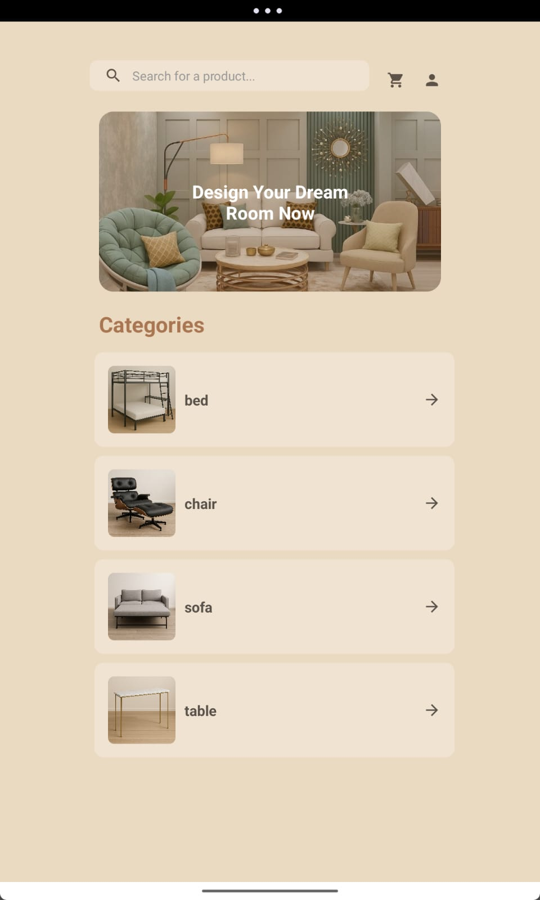
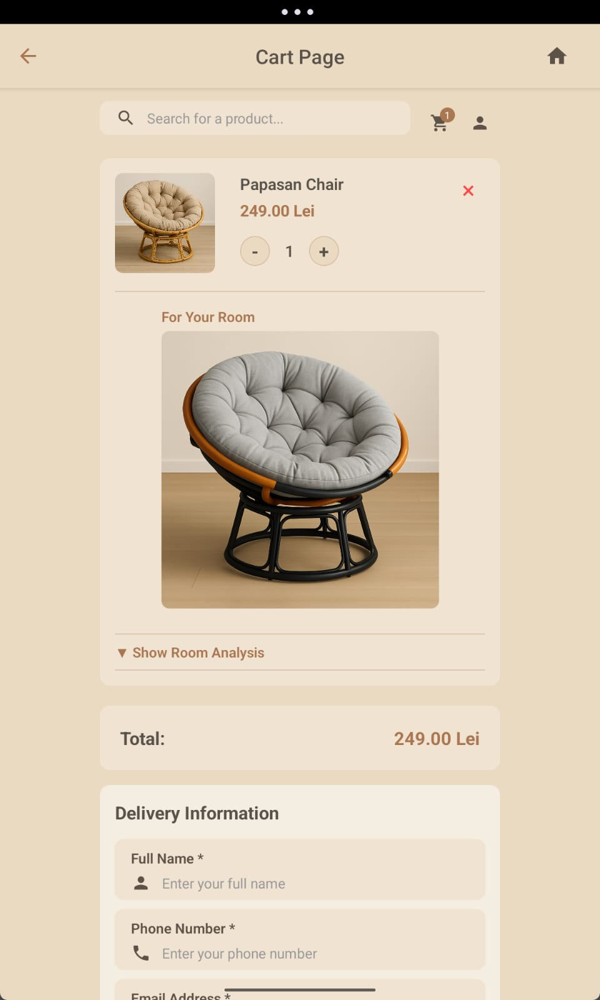
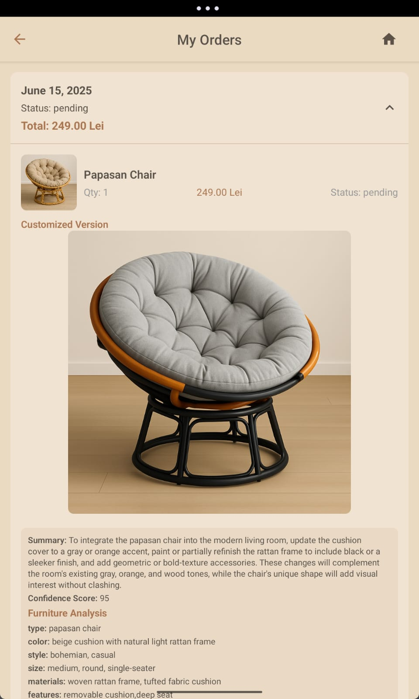
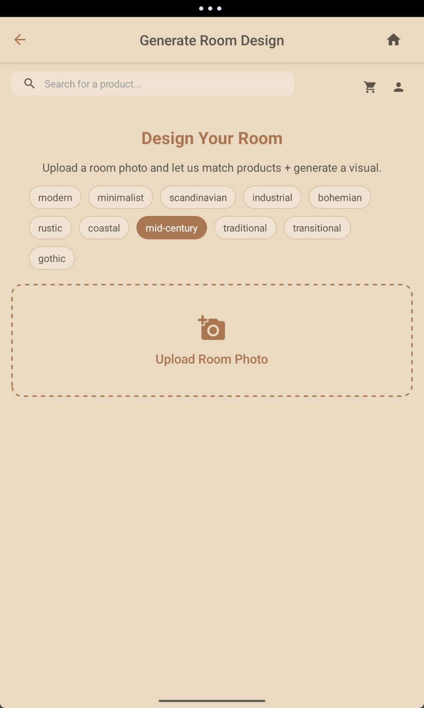
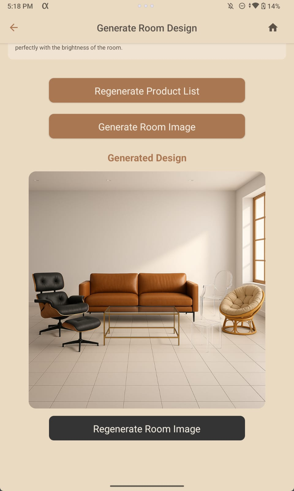
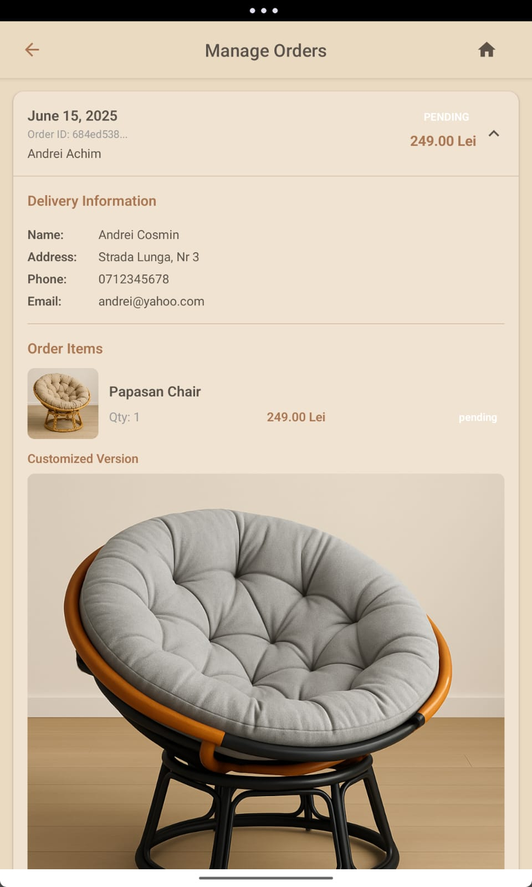

# Furniture Store App

A **React Native app** for **designing, purchasing, and managing furniture orders seamlessly**. Customers can browse products, generate AI-based room designs, and track orders in real-time, while employees can manage and fulfill orders efficiently.

This app communicates with the [andreicosmin02/furniture-store-api](https://github.com/andreicosmin02/furniture-store-api) for authentication, product, order, and room generation functionalities.

## Features

- **Product browsing, cart, and checkout**
- **Room design generator** with style selection and image upload
- **AI-based furniture placement and analysis**
- **Real-time order tracking**
- **Admin/employee order management panel**
- **JWT authentication and protected routes**

## Screenshots

<p align="center">
  
  
  <br>
  
  
  
</p>

## Installation

1. Clone the repository:

```bash
git clone https://github.com/andreicosmin02/furniture-store-app
cd furniture-store-app
```

2. Install dependencies:

```bash
npm install
```

3. Create a `.env` or use Expo's environment system to set:

```
EXPO_PUBLIC_API_URL=https://your-api-url/
```

4. Run the app:

```bash
npm start
```

## API Reference

This app integrates with [andreicosmin02/furniture-store-api](https://github.com/andreicosmin02/furniture-store-api) for:

- User authentication and profile management
- Product catalog retrieval and search
- Order creation, tracking, and admin management
- AI-powered room design generation and analysis

## Tech Stack

- **Frontend:** React Native, Expo, TypeScript
- **State:** Zustand
- **Backend:** Node.js, Express.js (via furniture-store-api)
- **Database:** MongoDB

---

Build once, furnish many.
